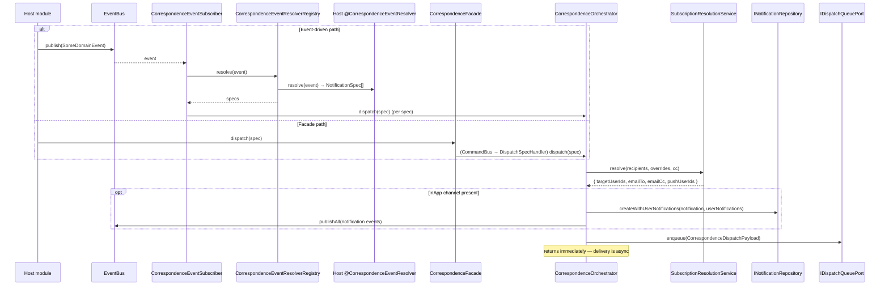
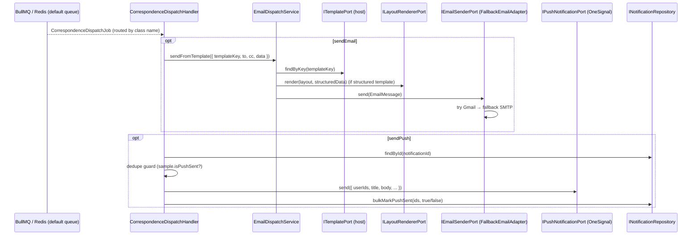

# `@nabarun-ngo/nestjs-shared-correspondence`

Notifications, email, push, and resource-subscription management for the Nabarun platform, packaged as a self-contained DDD bounded context. A host app registers a few ports (persistence, template store, dispatch queue) and the module handles the rest: turning "something happened" into delivered in-app / email / push notifications, plus the subscription preferences that decide **who** gets them.

This document describes the **responsibility of every class** and the **complete runtime flow**. For cross-cutting rules (facade boundaries, identity ports, DDD layering) see `.cursor/rules/*.mdc`.

---

## 1. Two ways correspondence is triggered

There are exactly two entry points into the context. Everything else is internal.

| Path | Entry point | Who uses it | How |
|---|---|---|---|
| **Event-driven** | A domain event published on the CQRS `EventBus` | Any module that already emits domain events | Host implements a `@CorrespondenceEventResolver()` that maps its event → `NotificationSpec[]`; the package discovers it and dispatches automatically |
| **Facade** | `CorrespondenceFacade.dispatch(spec)` | Host adapters / cron jobs that build a spec explicitly | Builds a `NotificationSpec` and dispatches via CommandBus |

Both paths converge on the same **`CorrespondenceOrchestrator`**, which is the heart of the engine.

Reads (list notifications, unread count, subscriptions) and subscription writes (subscribe, update channels) enter through the **REST controllers** → CommandBus / QueryBus.

---

## 2. Directory map

```
src/
├── correspondence.module.ts          Dynamic module: wiring, provider registration, startup validation
├── correspondence.schema.ts          Zod schema for module options (email/push/retention config)
├── correspondence-options.token.ts   DI token for validated options
├── email-template.schema.ts          Zod schema + types for JSON-store email template payloads
├── index.ts                          Public barrel — the ONLY supported import surface for hosts
│
├── domain/                           Pure TypeScript, zero framework deps
│   ├── aggregates/                   Notification, UserNotification, ResourceSubscription
│   ├── entities/                     SubscriptionChannel (child of ResourceSubscription)
│   ├── enums/                        ChannelType, EmailRole, NotificationType/Priority, SubscribedVia, SubscriberType
│   ├── events/                       6 past-tense domain events
│   ├── errors/                       Typed BusinessErrors
│   ├── policies/                     EmailRecipientPolicy, PushRecipientPolicy (pure rules)
│   ├── ports/                        Outbound contracts: email/push/queue/template/layout
│   └── repositories/                 Repository interfaces (host implements)
│
├── application/
│   ├── model/                        NotificationSpec + correspondence vocabulary (recipients/channels)
│   ├── dispatch/                     ⭐ THE CORE ENGINE
│   │   ├── correspondence-orchestrator.ts     Conductor: resolve → persist → enqueue
│   │   ├── subscription-resolution.service.ts Step: resolve recipients (users/roles/resource)
│   │   ├── email-dispatch.service.ts          Step: compose email from template + send
│   │   └── inbound/                           Trigger: domain event → NotificationSpec
│   │       ├── correspondence-event.subscriber.ts
│   │       ├── correspondence-event-resolver.ts        (decorator + interface)
│   │       └── correspondence-event-resolver.registry.ts
│   ├── retention/                    RetentionSchedulerService (cron housekeeping — NOT the engine)
│   ├── commands/                     11 command + handler pairs (write side)
│   ├── queries/                      5 query + handler pairs (read side)
│   ├── dtos/                         Request/response DTOs
│   ├── mappers/                      Aggregate → DTO mappers
│   ├── facade/                       CorrespondenceFacade (cross-boundary write entry)
│   └── jobs/                         Queue job classes (BullMQ job-name carriers)
│
├── infrastructure/                   Concrete adapters (Prisma-free; talks to external systems)
│   ├── email/                        Gmail / SMTP / Fallback email senders
│   ├── push/                         OneSignal push adapter
│   ├── templates/                    Handlebars layout renderer
│   └── queue/                        BullMQ job handlers (consumer side)
│
└── presentation/
    └── controllers/                  3 REST controllers
```

---

## 3. The complete flow

### 3a. Producer side — from trigger to enqueued job



### 3b. Consumer side — the async worker delivers



The queue mechanics (dispatch → `QueueFacade` → `CommandBus` → BullMQ → worker → routing by job-class name) live in `@nabarun-ngo/nestjs-shared-queue`. The `@QueueHandler(CorrespondenceDispatchJob)` decorator on `CorrespondenceDispatchHandler` registers it as the processor; retries use `attempts: 3, backoff: exponential 5s`.

---

## 4. Class responsibility reference

### 4.1 Module & configuration

| Class / symbol | Responsibility |
|---|---|
| `CorrespondenceModule` | Dynamic module. `forRoot` / `forRootAsync` validate options, require a host `queueModule`, register all providers/controllers, and export only `CorrespondenceFacade`. |
| `CorrespondenceModuleValidator` | Startup guard. Fails fast if required ports (`INotificationRepository`, `IUserNotificationRepository`, `IResourceSubscriptionRepository`, `ITemplatePort`, `IDispatchQueuePort`) are missing; warns if `IUserLookupPort` / `IUserRolePort` are absent. |
| `CorrespondenceOptionsSchema` | Zod schema for module options: `appName`, `environment`, `email` (from/SMTP/mocking), `push.oneSignal`, `retention` days. |
| `CORRESPONDENCE_OPTIONS` | DI token holding the validated options object. |
| `EmailTemplatePayloadSchema` / `EmailLayoutDataSchema` | Zod schemas validating JSON-store email template payloads consumed by the host `ITemplatePort` adapter. |

### 4.2 Domain layer (pure, no framework)

**Aggregates**

| Class | Responsibility |
|---|---|
| `Notification` | Aggregate root for a single logical notification (title/body/type/category/priority/action/reference/etc.). `create()` emits `NotificationCreatedEvent`; `isExpired()` checks TTL. Immutable identity, `#`-private fields. |
| `UserNotification` | Per-recipient copy of a `Notification`. Tracks read/archived/push state. State methods `markAsRead()`, `archive()`, `markPushDelivered()` enforce invariants (throw `NotificationAlreadyRead/ArchivedError`) and emit the matching domain events. |
| `ResourceSubscription` | Aggregate root for a user's or role's subscription to a resource. Holds `SubscriptionChannel` children. `deactivate()`/`reactivate()` emit events; `updateChannelConfig()` / `updateEmail()` mutate child channels/email. Factories: `createUserSubscription`, `createRoleSubscription`. |

**Entities**

| Class | Responsibility |
|---|---|
| `SubscriptionChannel` | Child entity of `ResourceSubscription`. One per channel (EMAIL/PUSH/IN_APP), holds `enabled` + optional `emailRole` (TO/CC). `updateConfig()` mutates. No events, no repository. |

**Enums**

| Enum | Responsibility |
|---|---|
| `ChannelType` | Delivery channel: EMAIL / PUSH / IN_APP. |
| `EmailRole` | Whether an email recipient is TO or CC. |
| `NotificationType` / `NotificationPriority` | Classification and urgency of a notification. |
| `SubscribedVia` | How a subscription was created (e.g. MANUAL). |
| `SubscriberType` | USER vs ROLE subscription. |

**Domain events** (all past-tense, extend `DomainEvent`, carry an aggregate snapshot)

| Event | Emitted when |
|---|---|
| `NotificationCreatedEvent` | A `Notification` is created. |
| `UserNotificationReadEvent` | A user marks a notification read. |
| `UserNotificationArchivedEvent` | A user archives a notification. |
| `NotificationPushDeliveredEvent` | Push delivery is attempted/recorded on a `UserNotification`. |
| `SubscriptionDeactivatedEvent` | A subscription is deactivated. |
| `SubscriptionReactivatedEvent` | A subscription is reactivated. |

**Errors** (extend `BusinessError` with code + HTTP status)

| Error | Meaning |
|---|---|
| `NotificationNotFoundError` / `UserNotificationNotFoundError` / `SubscriptionNotFoundError` | 404 lookups. |
| `TemplateNotFoundError` | Email template key missing/invalid (404). |
| `NotificationAlreadyReadError` / `NotificationAlreadyArchivedError` | Invariant violations (400). |
| `TokenNotAvailableError` | OAuth token missing → SMTP fallback (503). |
| `EmailDeliveryFailedError` | Email send failed (502). |

**Policies** (pure, stateless business rules)

| Class | Responsibility |
|---|---|
| `EmailRecipientPolicy` | Decides which active subscribers are email-eligible and whether each is TO or CC. |
| `PushRecipientPolicy` | Decides which active subscribers are push-eligible. |

**Ports** (outbound contracts — token symbol name equals the interface name; host or infra implements)

| Port | Contract |
|---|---|
| `IEmailSenderPort` | `send(EmailMessage)` — deliver a composed email. |
| `IPushNotificationPort` | `send(PushNotificationPayload)` — deliver a push. |
| `ITemplatePort` | `findByKey(key)` — fetch an email template definition (host-owned store). |
| `ILayoutRendererPort` | `render(layoutName, data)` — render structured content into a base `.hbs` layout. |
| `IDispatchQueuePort` | `enqueue(CorrespondenceDispatchPayload)` — hand delivery to the async queue (host-owned). |

**Repositories** (interfaces; host binds Prisma adapters in its persistence module)

| Repository | Key methods beyond `IRepository` |
|---|---|
| `INotificationRepository` | `createWithUserNotifications` (atomic), `bulkMarkPushSent`, `deleteExpiredBefore`. |
| `IUserNotificationRepository` | `findByUserAndNotification`, `countUnread`, `markAllReadForUser`. |
| `IResourceSubscriptionRepository` | `findByUserAndResource`, `findByRoleAndResource`, `findActiveSubscribersForResource`, `updateEmailForUser`, `deleteInactiveBefore`. |

### 4.3 Application layer

**Model**

| Class / type | Responsibility |
|---|---|
| `NotificationSpec` | Internal normalized request: `{ recipients, channels }`. Built by resolvers or host adapters; the single input to the orchestrator. |
| `correspondence-types.ts` | The shared vocabulary — `CorrespondenceRecipients` (users/roles/resource modes), `CorrespondenceChannels` (inApp/email/push option shapes), `NotificationAction`. Re-exported as public API. |

**Dispatch — the core engine**

| Class | Responsibility |
|---|---|
| `CorrespondenceOrchestrator` | Conductor of the dispatch pipeline: resolve recipients → (if `inApp`) persist `Notification` + `UserNotification`s and publish their events → enqueue an async delivery job. Skips everything when zero recipients resolve. |
| `SubscriptionResolutionService` | Resolves a `CorrespondenceRecipients` into concrete `{ targetUserIds, emailTo, emailCc, pushUserIds }`. Handles the three modes (explicit users, roles, resource subscribers), expands roles via `IUserRolePort` + `IUserLookupPort`, and applies the email/push policies. |
| `EmailDispatchService` | Email composition + delivery step. Fetches a template (`ITemplatePort`), compiles raw Handlebars **or** renders structured content into a layout (`ILayoutRendererPort`), resolves placeholders, and sends via `IEmailSenderPort`. Injected directly by the queue worker; exposes `EmailDispatchInput`. |

**Dispatch / inbound — event trigger**

| Class | Responsibility |
|---|---|
| `CorrespondenceEventSubscriber` | Subscribes once to the `EventBus`; for each published event, asks the registry for specs and dispatches each through the orchestrator. Errors are contained so one bad resolver never kills the subscription. |
| `CorrespondenceEventResolverRegistry` | On startup, discovers all `@CorrespondenceEventResolver()` providers (via `DiscoveryService`) and indexes them by event class. `resolve(event)` returns flattened `NotificationSpec[]` (or null). |
| `CorrespondenceEventResolver` (+ `ICorrespondenceEventResolver`) | The decorator + interface a **host** implements to map one of its domain events to notification specs. Matching is by class reference, so the package never imports host event types. |

**Retention** (housekeeping, separate from the engine)

| Class | Responsibility |
|---|---|
| `RetentionSchedulerService` | On bootstrap, schedules two repeating BullMQ jobs (daily notification purge, weekly inactive-subscription purge). Also exposes `purgeOldNotifications` / `purgeInactiveSubscriptions` invoked by the purge queue handlers. |

**Commands** (write side — each `*Command` is an immutable data holder; each `*Handler` executes it via repositories/ports and publishes events)

| Command → Handler | Responsibility |
|---|---|
| `DispatchSpecCommand` → `DispatchSpecHandler` | Facade write path: forwards a `NotificationSpec` to the orchestrator through the bus. |
| `MarkUserNotificationReadCommand` → handler | Marks one user notification read. |
| `MarkAllUserNotificationsReadCommand` → handler | Marks all of a user's notifications read. |
| `ArchiveUserNotificationCommand` → handler | Archives one user notification. |
| `ResendPushCommand` → `ResendPushHandler` | Re-attempts push for a single user notification (ownership-checked), records delivery outcome. |
| `SubscribeUserCommand` → `SubscribeUserHandler` | Creates or reactivates a user's resource subscription with channels. |
| `SubscribeRoleCommand` → handler | Creates/reactivates a role subscription. |
| `UnsubscribeUserCommand` → handler | Deactivates a user's subscription. |
| `UnsubscribeRoleCommand` → handler | Deactivates a role subscription. |
| `UpdateChannelConfigCommand` → handler | Enables/disables a channel (and email TO/CC role) on a subscription. |
| `UpdateSubscriberEmailCommand` → handler | Updates the cached email across a user's subscriptions. |

**Queries** (read side — `*Query` data holder + `*Handler` returning DTOs)

| Query → Handler | Responsibility |
|---|---|
| `GetUserNotificationsQuery` → handler | Paged list of the current user's notifications (`BaseFilter` → `PagedResponse`). |
| `GetUnreadCountQuery` → handler | Unread count for a user. |
| `GetNotificationsAdminQuery` → handler | Paged admin list of all notifications. |
| `GetUserSubscriptionsQuery` → handler | A user's subscriptions (optionally scoped to a resource). |
| `GetResourceSubscribersQuery` → handler | All subscribers for a given resource. |

**Facade, DTOs, mappers, jobs, ports**

| Class | Responsibility |
|---|---|
| `CorrespondenceFacade` | The only cross-boundary **write** entry point. `dispatch(spec)` → `DispatchSpecCommand` on the CommandBus. |
| `NotificationResponseDto` / `UserNotificationResponseDto` / `SubscriptionResponseDto` (+ `SubscriptionChannelDto`) | API response shapes with Swagger metadata. |
| `GetUserNotificationsRequestDto` / `GetAdminNotificationsRequestDto` / `SubscribeUserRequestDto` / `UpdateChannelConfigRequestDto` | Validated request inputs. |
| `NotificationMapper` / `SubscriptionMapper` | Map aggregates → response DTOs. |
| `CorrespondenceDispatchJob` | Carrier class whose name is the stable BullMQ job name for async delivery; wraps `CorrespondenceDispatchPayload`. |
| `PurgeNotificationsJob` / `PurgeSubscriptionsJob` | Carrier classes for the two scheduled retention jobs. |

### 4.4 Infrastructure layer (adapters)

| Class | Responsibility |
|---|---|
| `FallbackEmailAdapter` | Default `IEmailSenderPort`. Tries Gmail (if an OAuth token is available), falls back to SMTP on missing token or Gmail failure. |
| `GmailEmailAdapter` | Sends via the Gmail API using an OAuth access token; builds the raw MIME message. |
| `SmtpEmailAdapter` | Sends via Nodemailer/SMTP using configured host/credentials. |
| `OneSignalPushAdapter` | `IPushNotificationPort` via OneSignal; targets users by external id, maps title/body/image/data. |
| `HandlebarsLayoutRendererAdapter` | `ILayoutRendererPort`. Loads and caches base `.hbs` layouts (shipped with the package), registers helpers, renders structured content to HTML. |
| `CorrespondenceDispatchHandler` | `@QueueHandler(CorrespondenceDispatchJob)` — the async worker. Sends email via `EmailDispatchService` and push via `IPushNotificationPort`, with a retry-safe dedupe guard and `bulkMarkPushSent` bookkeeping. |
| `PurgeNotificationsHandler` / `PurgeSubscriptionsHandler` | `@QueueHandler`s for the scheduled retention jobs; delegate to `RetentionSchedulerService`. |

### 4.5 Presentation layer (REST)

All controllers are guarded by `UnifiedAuthGuard` + `PermissionsGuard`, use `requireUserId(user)` (app profile UUID, never `idpSub`), and dispatch through CommandBus / QueryBus only.

| Controller | Routes / responsibility |
|---|---|
| `UserNotificationController` (`correspondence/notifications/me`) | Current user's notifications: paged list, unread count, mark read, mark-all read, archive, resend push. |
| `NotificationAdminController` (`correspondence/admin/notifications`) | Admin paged list of all notifications. |
| `SubscriptionController` (`correspondence/subscriptions`) | Subscribe / unsubscribe / update channels for the current user, list own subscriptions, list a resource's subscribers. |

---

## 5. Host integration (summary)

The package is intentionally host-agnostic. A consuming app wires it up like this:

```ts
CorrespondenceModule.forRoot(
  { environment, appName, email: {...}, push: {...}, retention: {...} },
  {
    imports: [AuthModule, UserModule],   // provide IUserRolePort + IUserLookupPort (both optional)
    queueModule: QueueModule.forRoot(...) // required — hosts the @QueueHandler workers
  },
)
```

The host must additionally:

- Bind repository tokens (`INotificationRepository`, `IUserNotificationRepository`, `IResourceSubscriptionRepository`) to Prisma adapters in its persistence module.
- Provide `{ provide: ITemplatePort, useClass: ... }` (email template store) and `{ provide: IDispatchQueuePort, useClass: ... }` (queue adapter).
- Optionally implement `@CorrespondenceEventResolver()` providers to drive the event-driven path.

Only the symbols exported from `index.ts` are supported for host use. Repository tokens are exported **for host persistence wiring only** (see `.cursor/rules/module-facade-boundary.mdc`).

---

## 6. Key design decisions

- **`application/dispatch/` is the engine.** The full pipeline — trigger (`inbound/`) → orchestrate → resolve recipients → compose email — lives in one cohesive folder. Retention is deliberately kept out in `application/retention/` because it's housekeeping, not dispatch.
- **`idpSub` never leaves auth.** All recipient/audit references use `userId` (app profile UUID). Role expansion is the one justified place `idpSub` is used, because auth RBAC tables are keyed by it (see `.cursor/rules/user-identity-ports.mdc`).
- **Delivery is always async.** The orchestrator only persists + enqueues; actual email/push happens in the queue worker so request latency and delivery failures are decoupled.
- **Ports over concretions.** Email/push/template/queue are all ports so the host can swap providers, and the package never imports host event classes (resolvers match by class reference).
